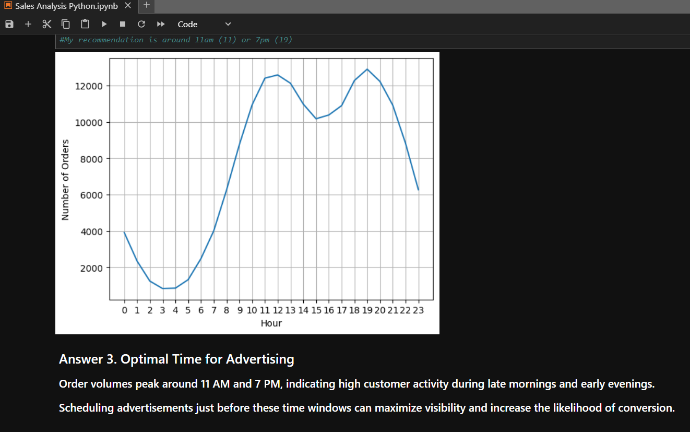
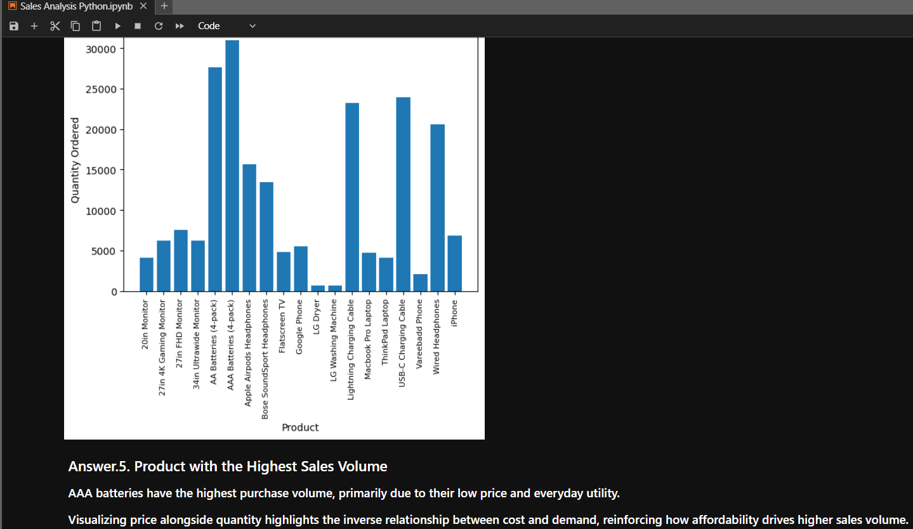
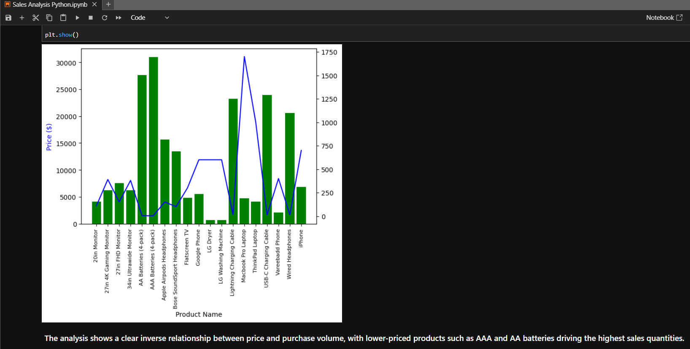

# 📊 Sales Data Analysis using Python (Pandas & Matplotlib)

## 📌 Project Overview
This project analyzes **12 months of sales data** from an electronics retailer to uncover actionable business insights. Using **Python (Pandas & Matplotlib)**, the analysis focuses on data cleaning, exploratory analysis, and visualization to answer key business questions related to sales performance, customer behavior, and product trends.

---

## 🧠 Business Context
An electronics retailer wants to understand:
- Which months generate the highest revenue  
- Which cities drive the most sales  
- When customers are most likely to purchase  
- Which products are frequently bought together  

The objective is to use historical sales data to support **data-driven decision-making** for marketing, inventory, and sales strategy.

---

## 📂 Dataset Overview
- **Time period:** 12 months  
- **Records:** Hundreds of thousands of transactions  
- **Key attributes:**
  - Order date  
  - Product type  
  - Quantity ordered  
  - Price per unit  
  - Purchase address (city-level)  

---

## ⭐ STAR Method

### 🔹 Situation
The company has large volumes of raw transactional sales data but lacks clarity on sales trends, customer purchase behavior, and product performance.

---

### 🔹 Task
- Clean and prepare raw sales data for analysis  
- Explore the data to answer high-impact business questions  
- Visualize insights in a clear and interpretable way  

---

### 🔹 Action

#### Data Cleaning
- Dropped missing values (`NaN`)  
- Removed invalid rows based on business rules  
- Converted columns to appropriate data types using:
  - `to_numeric`
  - `to_datetime`
  - `astype`
- Combined multiple monthly CSV files into a single dataset using `pd.concat`

#### Feature Engineering
- Created new columns using:
  - String parsing (`.str`)
  - Custom logic via `.apply()`

#### Exploratory Data Analysis
- Used `groupby` for aggregate analysis  
- Answered business questions using descriptive statistics  
- Built visualizations using **Matplotlib**:
  - Bar charts  
  - Line charts  
- Added titles, labels, and annotations for clarity  

---

### 🔹 Result
- Identified the **best-performing month** by total revenue  
- Determined the **top-selling city**  
- Found the **optimal time window for advertisements**  
- Discovered **product bundling patterns**  
- Analyzed why certain products outperform others  

These insights directly support **marketing optimization, inventory planning, and sales strategy**.

---

## ❓ Key Business Questions Answered
1. What was the best month for sales, and how much revenue was generated?  
2. Which city sold the most products?  
3. What time should advertisements be displayed to maximize purchases?  
4. Which products are most often sold together?  
5. Which product sold the most, and why?  

---

## 📊 Key Visual Insights

### Monthly Sales Trend

### Sales by City

### Optimal Advertisement Timing

### Top Selling Products

### Price vs Quantity Relationship

---

## 🛠 Tools & Skills Demonstrated
- **Python**  
- **Pandas** (data cleaning, transformation, aggregation)  
- **Matplotlib** (data visualization)  
- **Exploratory Data Analysis (EDA)**  
- **Business-focused data storytelling**  

---

## 📌 Key Takeaways
- Data cleaning is critical before analysis  
- Timing and location significantly impact sales performance  
- Product bundling insights can drive cross-selling strategies  
- Visualization helps translate data into business decisions  

---

## 🚀 Why This Project Matters
This project demonstrates my ability to:
- Work with large, real-world datasets  
- Translate business questions into analytical steps  
- Perform end-to-end data analysis using Python  
- Communicate insights effectively through visualizations  

